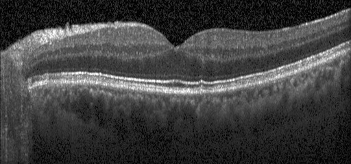
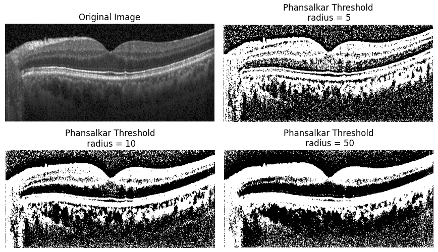
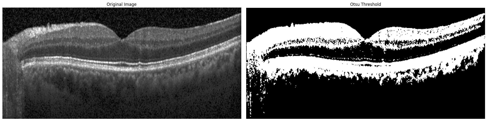

# pythresh
A collection of thresholding methods implemented for numpy and pytorch arrays


## Description
`img_threshold` is a Python package providing a variety of image thresholding techniques with a focus on support for PyTorch gradient functionality. This package fills the gap for advanced thresholding methods that are differentiable and can be used in deep learning pipelines.

## Installation

Install `img_threshold` using pip:

```bash
pip install git+https://https://github.com/hallurr/pythresh.git
```

## Examples

For illustrative purposes a normal optical coherence tomography image has been chosen to demonstrate from the publicly available [kaggle databank](https://www.kaggle.com/datasets/paultimothymooney/kermany2018). 
<div align="center">
  
</div>


<div style="height: 20px;"></div>

## Phansalkar’s thresholding method


Phansalkar’s thresholding is suited for local thresholding.

The normalized image is assessed for each pixel whether its value is greater than the following threshold:

$$
\mu \cdot \left(1.0 + p \cdot \exp(-q \cdot \mu) + k \cdot \left(\frac{\sigma}{r} - 1\right)\right)
$$

  
where $\mu$ and $\sigma$ are the mean and the standard deviation of neighbourhood, respectively. 
$k$, $r$, $p$, and $q$ are changeable parameters defaulted to:\
$k=0.25$\
$r=0.5$\
$p=2.0$\
$q=10.0$

Described in [N. Phansalskar, S. More, and A. Sabale, et al., Adaptive local thresholding for detection of nuclei in diversity stained cytology images, International Conference on Communications and Signal Processing (ICCSP), 2011. ](https://ieeexplore.ieee.org/document/5739305/)
### Example

```
import sys
import os

# Add the parent directory to the sys.path list
sys.path.append(os.path.abspath('../')) 

# Phansalkar method example
from img_threshold.threshold_methods import phansalkar
from img_threshold.utils import *

# load the Normal OCT image
img = load_image('NORMAL-OCT.jpeg')[:, :, 0]

# Show the input and outputs
images = [img, 
          phansalkar(img, radius=10), 
          phansalkar(img, radius=25), 
          phansalkar(img, radius=50)]

titles = ['Original Image', 
          'Phansalkar Threshold\n radius = 5', 
          'Phansalkar Threshold\n radius = 10', 
          'Phansalkar Threshold\n radius = 50']

show_images(images, titles=titles, cmap='gray', figsize=(15, 10))
```
<div align="center">


</div>

<div style="height: 20px;"></div>

## Otsu thresholding method


Using a "Faster Approach" the threshold with the maximum between class variance also has the minimum within class variance [labbookpages](http://www.labbookpages.co.uk/software/imgProc/otsuThreshold.html).
    
Described in [N. Otsu, "A Threshold Selection Method from Gray-Level Histograms," in IEEE Transactions on Systems, Man, and Cybernetics, vol. 9, no. 1, pp. 62-66, Jan. 1979, doi: 10.1109/TSMC.1979.4310076.](https://ieeexplore.ieee.org/document/4310076).


### Example

```
# Otsu method example
import sys
import os

# Add the parent directory to the sys.path list
sys.path.append(os.path.abspath('../'))

# Phansalkar method example
from img_threshold.threshold_methods import otsu
from img_threshold.utils import *

# load the Normal OCT image
img = load_image('NORMAL-OCT.jpeg')[:, :, 0]
otsu_thresholded = otsu(img)

images = [load_image('NORMAL-OCT.jpeg')[:, :, 0], 
          otsu(img)]

titles = ['Original Image', 
          'Otsu Threshold']

show_images(images, titles=titles, cmap='gray', figsize=(15, 10))
```
<div align="center">

</div>